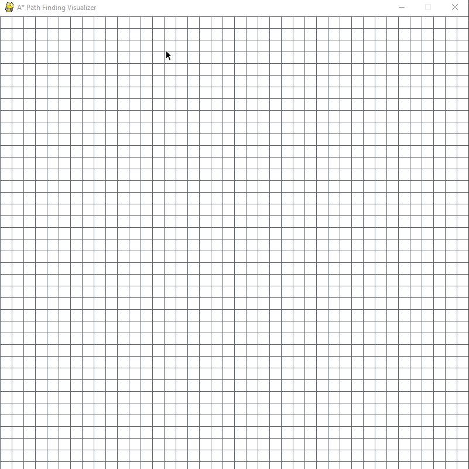

# A* Path Finding Visualizer

## 📖 About 
### An A* Path Finding interactive visualizer made with Pygame.

Project made with the purpose of studying [A\* search algorithm](https://en.wikipedia.org/wiki/A*_search_algorithm), Python classes and functions and visual interaction with Pygame.

Project under [MIT License](LICENSE.txt).

## 📽️ Demos

## 💻 Usage 

1. Run `main.py`:

    - `python main.py` if  Windows
    - `python3 main.py` if Linux/macOS

2. Interact with the display:
    
    - First `left click` sets the `start` node;
    - Second `left click` sets `end` node;
    - The other clicks sets the `barriers` nodes, i.e. blocked nodes that won't be able to be passed through;
    - Any node can be reseted with a `right click` on it;
    - Press `space` to start the algorithm;
    - Pressing `c` resets it all.

## ⚙️ Setup
First, clone this repo with:

`git clone https://github.com/cauabernardino/astar_pathfinding`

Then install the requirements:

- For Windows: `pip install -r requirements.txt`
- For Linux/macOS: `pip3 install -r requirements.txt`
